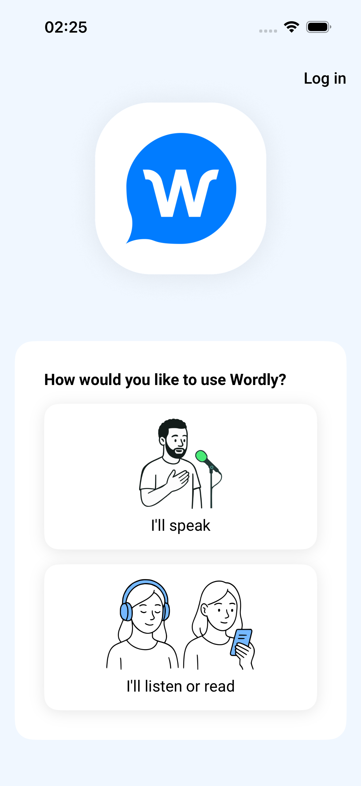

# Directional relative locators against Wordly iOS

Date: 2026-06-29

This proof fixes the fresh-project Wordly iOS EULA blocker found while validating NativeProof
onboarding from a fresh folder.

## Blocker

A readable fresh-project spec first used:

```ts
native.getByRole("button").near(native.getByText(/I have read and agreed/i), { maxDistance: 120 });
```

Against the real Wordly iOS app, `.near()` selected the closer `Privacy Policy` link instead of the
unnamed agreement checkbox. Evidence:

- [ios-before-leftof-failure-excerpt.log](ios-before-leftof-failure-excerpt.log)

Classification: NativeProof product gap. The app also has an accessibility weakness because the
agreement checkbox is exposed as an unnamed iOS button, but NativeProof could not express the
intended relative target without falling back to XML parsing or coordinates in the spec.

## Fix

This branch adds directional relative locator filters:

```ts
native.getByRole("button").leftOf(native.getByText(/I have read/i), { maxDistance: 120 });
native.getByRole("button").rightOf(native.getByText("Volume"));
native.getByRole("button").above(native.getByText("Volume"));
native.getByRole("button").below(native.getByText("Volume"));
```

## NativeProof checks

Commands:

```sh
npm run check
npm test
```

Results:

- [nativeproof-check.log](nativeproof-check.log): passed
- [nativeproof-test.log](nativeproof-test.log): passed, 129 tests

## Fresh Wordly iOS proof

Fresh project:

```text
/tmp/nativeproof-directional-locators-wordly-proof-20260629T012241Z/ios-fresh-project
```

Commands:

```sh
npm pack --pack-destination /tmp/nativeproof-directional-locators-wordly-proof-20260629T012241Z
npm init -y
npm install /tmp/nativeproof-directional-locators-wordly-proof-20260629T012241Z/nativeproof-0.10.14.tgz
npx nativeproof --version
npx nativeproof init --ios
npx nativeproof onboard /Users/agents/Projects/nativeproof-wordly-ios-repo-onboard-proof/build/ios/Wordly.app
xcrun simctl uninstall booted ai.wordly.ios.dev
npx nativeproof --ios
```

Results:

- [00-nativeproof-pack.log](00-nativeproof-pack.log): tarball packed from this branch
- [ios-01-npm-init.log](ios-01-npm-init.log): fresh npm project created
- [ios-02-npm-install-nativeproof-tarball.log](ios-02-npm-install-nativeproof-tarball.log): local tarball installed
- [ios-03-nativeproof-version.log](ios-03-nativeproof-version.log): `0.10.14`
- [ios-04-nativeproof-init-ios.log](ios-04-nativeproof-init-ios.log): `nativeproof init --ios` created config/spec/package
- [ios-05-nativeproof-onboard-wordly-app.log](ios-05-nativeproof-onboard-wordly-app.log): Wordly `.app` onboarded
- [ios-06-generated-config.log](ios-06-generated-config.log): generated config after onboard
- [ios-07-wordly-eula-spec.log](ios-07-wordly-eula-spec.log): readable Wordly spec using `.leftOf(...)`
- [ios-09-nativeproof-ios-wordly-eula-run-summary.log](ios-09-nativeproof-ios-wordly-eula-run-summary.log): passed, 1 spec

NativeProof evidence captured by the passing spec:

- [wordly-ios-eula-accepted-role-selection.png](wordly-ios-eula-accepted-role-selection.png)
- [wordly-ios-eula-accepted-role-selection.xml](wordly-ios-eula-accepted-role-selection.xml)



## Truth notes

- This proof used a locally packed NativeProof tarball from this branch. It does not claim the
  currently published npm package has the fix.
- The literal login north-star remains app/backend-seam dependent. This proof closes the current
  fresh-project iOS first-run agreement blocker.
