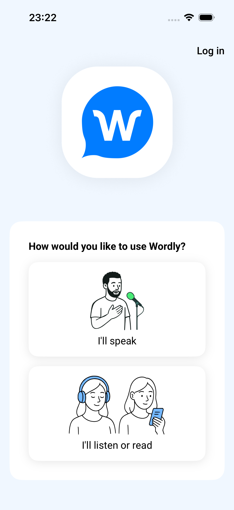
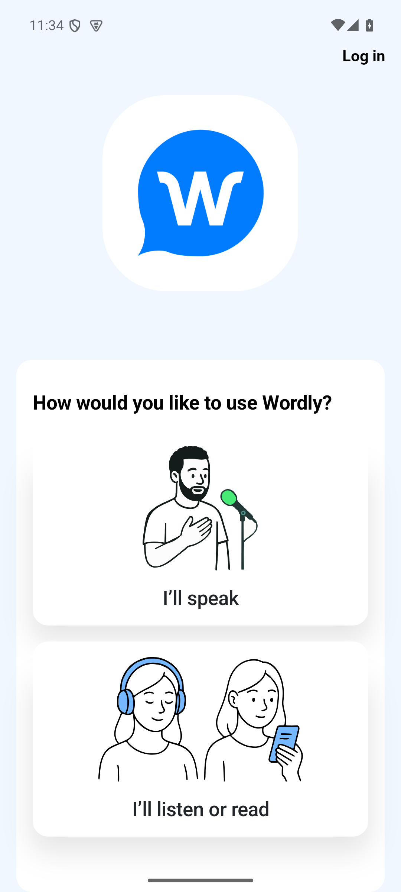

# Fresh Wordly Onboarding Proof

Date: 2026-06-28

This proof was run from fresh folders outside both repositories:

- iOS fresh project: `/Users/agents/Projects/nativeproof-wordly-loop-JbNA9R`
- Android fresh project: `/Users/agents/Projects/nativeproof-wordly-android-loop-0zbdtA`

## Published Package Check

Command:

```sh
npm view nativeproof version bin --json
```

Output:

```json
{
  "version": "0.10.12",
  "bin": {
    "nativeproof": "dist/cli.js",
    "nativeproof-init": "dist/cli.js"
  }
}
```

The current published package does not expose `nativeproof-onboard`; this proof used a locally packed
NativeProof 0.10.14 tarball from this branch, installed into fresh npm projects.

## NativeProof Blocker Fixed

The generated `nativeproof.config.ts` imports `nativeproof`. In a default `npm init -y` project without
`"type": "module"`, the first test run failed before reaching the Wordly app:

```text
Cannot require() ES Module /Users/agents/Projects/nativeproof-wordly-loop-JbNA9R/nativeproof.config.ts in a cycle. A cycle involving require(esm) is not allowed to maintain invariants mandated by the ECMAScript specification. Try making at least part of the dependency in the graph lazily loaded.
```

Full log: [ios-10-config-load-failure-before-fix.log](ios-10-config-load-failure-before-fix.log)

This branch fixes that by making `nativeproof init` and `nativeproof onboard` ensure generated or merged
`package.json` files have `"type": "module"`.

NativeProof verification after the fix:

- [nativeproof-check.log](nativeproof-check.log): `npm run check` passed
- [nativeproof-test.log](nativeproof-test.log): `npm test` passed with 127 tests

## iOS Fresh-Project Run

Commands run:

```sh
npm init -y
npm install ./nativeproof-0.10.14.tgz
npx nativeproof --version
npx nativeproof init --ios
git clone https://github.com/wordly-inc/wordly-mobile-ios.git ios/wordly-mobile-ios
npx nativeproof onboard ./ios/wordly-mobile-ios
xcrun simctl uninstall booted ai.wordly.ios.dev
npx nativeproof --ios
```

Key facts:

- Wordly iOS repo remote: `https://github.com/wordly-inc/wordly-mobile-ios.git`
- Wordly iOS commit tested: `bf105c8` on `main`, described as `v4.3.1`
- `nativeproof onboard` produced and staged `./build/ios/Wordly.app`
- The first successful spec drove the real Wordly iOS app through first-launch agreement acceptance

Passing output:

```text
[./build/ios/Wordly.app iOS #0-0] Wordly iOS first launch
[./build/ios/Wordly.app iOS #0-0]    ✓ should accept the agreement and show the home choices
[./build/ios/Wordly.app iOS #0-0]
[./build/ios/Wordly.app iOS #0-0] 1 passing (6.9s)

Spec Files:	 1 passed, 1 total (100% completed) in 00:00:12
```

Full logs:

- [ios-01-npm-init.log](ios-01-npm-init.log)
- [ios-02-npm-install-nativeproof.log](ios-02-npm-install-nativeproof.log)
- [ios-03-nativeproof-version.log](ios-03-nativeproof-version.log)
- [ios-04-nativeproof-init-ios.log](ios-04-nativeproof-init-ios.log)
- [ios-05-clone-wordly-ios.log](ios-05-clone-wordly-ios.log)
- [ios-06-wordly-ios-repo-state.log](ios-06-wordly-ios-repo-state.log)
- [ios-07-nativeproof-onboard-ios-repo.log](ios-07-nativeproof-onboard-ios-repo.log)
- [ios-08-onboarded-ios-artifact-and-config.log](ios-08-onboarded-ios-artifact-and-config.log)
- [ios-14-first-launch-pass.log](ios-14-first-launch-pass.log)

Screenshot:



Remaining iOS gap: the agreement control is visually a checkbox but is exposed by the app as an unlabeled
`XCUIElementTypeButton`, so the first green spec used a visible fallback locator near the agreement text.
That is a Wordly iOS accessibility/locator gap, not a NativeProof config-loading gap.

## Android Fresh-Project Run

Commands run:

```sh
npm init -y
npm install /Users/agents/Projects/nativeproof-wordly-loop-JbNA9R/.evidence/fixed-nativeproof/nativeproof-0.10.14.tgz
npx nativeproof --version
npx nativeproof init --android
npx nativeproof onboard /Users/agents/Agents/Jeeves/workspace/ralph_wordly_mobile_e2e_continue_2026-05-29/evidence/installed_base_20260530T013219Z.apk
npx nativeproof --android --no-appium
adb devices
npx nativeproof --android
```

Key facts:

- APK package: `tech.wordly.android.present`
- APK label: `Wordly(D)`
- APK version: `4.2.0 (73)-dev-dbg`
- The APK was an available real Wordly Android artifact, not a freshly built current Android repo
- `nativeproof onboard` updated the fresh config and package, including `"type": "module"`
- `npx nativeproof --android --no-appium` loaded config successfully and failed only because no Appium server was reachable
- The final run drove the real APK through first-launch agreement acceptance

Passing output:

```text
[installed_base_20260530T013219Z.apk Android #0-0] Wordly Android first launch
[installed_base_20260530T013219Z.apk Android #0-0]    ✓ should accept the agreement and show the home choices
[installed_base_20260530T013219Z.apk Android #0-0]
[installed_base_20260530T013219Z.apk Android #0-0] 1 passing (13s)

Spec Files:	 1 passed, 1 total (100% completed) in 00:00:26
```

Full logs:

- [android-01-npm-init.log](android-01-npm-init.log)
- [android-02-npm-install-fixed-nativeproof.log](android-02-npm-install-fixed-nativeproof.log)
- [android-03-nativeproof-version.log](android-03-nativeproof-version.log)
- [android-04-nativeproof-init-android.log](android-04-nativeproof-init-android.log)
- [android-05-nativeproof-onboard-android-apk.log](android-05-nativeproof-onboard-android-apk.log)
- [android-06-config-package-state.log](android-06-config-package-state.log)
- [android-07-config-load-no-appium.log](android-07-config-load-no-appium.log)
- [android-20-adb-devices-before-pass.log](android-20-adb-devices-before-pass.log)
- [android-21-first-launch-pass.log](android-21-first-launch-pass.log)

Screenshot:



## Classification

- NativeProof product gap: fixed here. Fresh projects need ESM package mode so generated TypeScript configs
  import correctly.
- Wordly iOS accessibility/locator gap: still open. The EULA checkbox is not exposed as a named checkbox.
- Wordly app/backend seam gap: still open for the literal login north-star. This proof covers first-launch
  onboarding because a truthful login proof needs app/backend routing and credentials/seams that were not
  established by this run.
- Local environment/tooling blocker: Android required an already booted, stable emulator and Appium driver.
  Once stable, the fresh project ran green.
