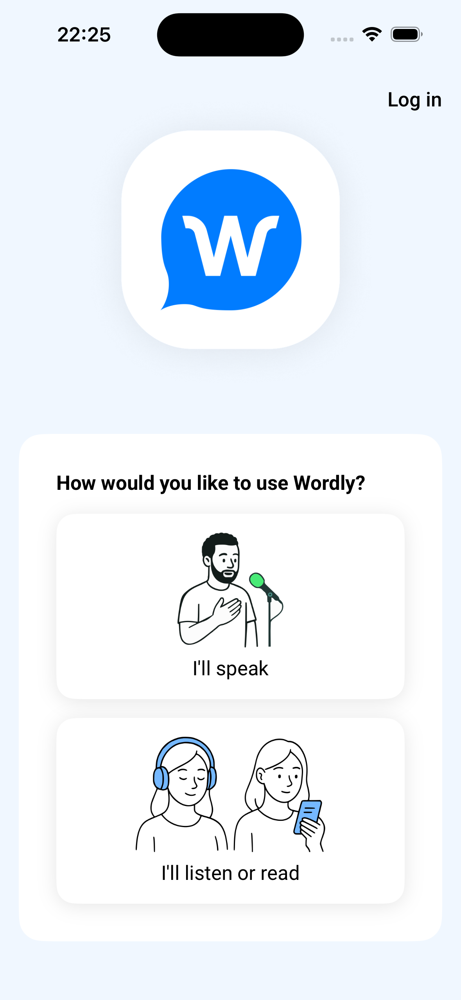

# Wordly iOS Fresh Consumer Proof

Date: 2026-06-28

This proof validates the NativeProof onboarding branch against a fresh consumer project and the
real private Wordly iOS app source, not the synthetic UIKit smoke app.

## Setup

- Fresh project: `/Users/agents/Projects/nativeproof-wordly-ios-repo-onboard-proof`
- NativeProof package: local PR tarball `nativeproof-0.10.14.tgz`
- Wordly iOS source: `wordly-inc/wordly-mobile-ios`
- Wordly iOS branch: `main`
- Wordly iOS commit: `bf105c8 release: v4.3.1 - TTS ordering/cutoff fixes, crash fix, attendee placeholder fix (#13)`
- Simulator: booted iPhone 16, iOS 26.5

## Commands

```sh
npm init -y
npm install /Users/agents/Projects/nativeproof-0.10.14.tgz
npx nativeproof init --ios
mkdir -p ios
gh repo clone wordly-inc/wordly-mobile-ios ios/wordly-mobile-ios -- --depth 1
npx nativeproof onboard ./ios/wordly-mobile-ios
```

NativeProof detected the Wordly Xcode project, selected the `Wordly Dev` scheme, built a Debug
simulator app, and staged the result at `./build/ios/Wordly.app`.

The Wordly build still exits `65` because the app's Crashlytics run script expects:

```text
.nativeproof/ios/DerivedData/SourcePackages/checkouts/firebase-ios-sdk/Crashlytics/run
```

That script path does not exist in the fresh package cache layout, but Xcode still produces a usable
91 MB simulator app before the late script failure. NativeProof now detects the produced app, warns,
continues, and writes the staged path into config.

Onboarding output ended with:

```text
nativeproof: xcodebuild exited 65, but produced ./build/ios/Wordly.app; continuing with that app.
nativeproof: updated nativeproof.config.ts
nativeproof: package.json already exists — skipped
nativeproof: onboarded ios app at ./build/ios/Wordly.app

Next: run `npm run test:e2e` or `nativeproof --ios`.
```

The fresh config contained:

```ts
capabilities: {
  "appium:app": "./build/ios/Wordly.app",
}
```

## Spec

The fresh consumer spec drove the real Wordly app through first launch, accepted the EULA, and
asserted the home choices:

```ts
import { expect, native } from "../nativeproof.config";

describe("Wordly iOS first launch", () => {
  it("should accept the agreement and show the home choices", async () => {
    await native.navigate("/");

    const AgreementText = native.getByText(/I have read and agreed to the/i);
    const AgreementAndText = native.getByText("and");
    const AcceptAgreementCheckbox = native.getByRole("button").near(AgreementAndText, { maxDistance: 45 });
    const AcceptButton = native.getByRole("button", { name: "Accept" });

    await expect(native.getByText(/End-User License Agreement/i)).toBeVisible();
    await expect(AgreementText).toBeVisible();
    await expect(AcceptButton).toBeDisabled();
    await AcceptAgreementCheckbox.tap();
    await expect(AcceptButton).toBeEnabled();
    await AcceptButton.tap();

    await expect(native.getByText("How would you like to use Wordly?")).toBeVisible();
    await expect(native.getByRole("button", { name: "I'll speak" })).toBeVisible();
    await expect(native.getByRole("button", { name: "I'll listen or read" })).toBeVisible();
  });
});
```

Run command:

```sh
npx nativeproof --ios
```

Result:

```text
Spec Files: 1 passed, 1 total (100% completed) in 00:01:08
Wordly iOS first launch
  ✓ should accept the agreement and show the home choices
```

Screenshot:



## Findings

NativeProof now satisfies the repo-path onboarding proof for this real iOS app:

```sh
npx nativeproof init --ios
npx nativeproof onboard ./ios/wordly-mobile-ios
npx nativeproof --ios
```

The EULA checkbox is not north-star readable because the current Wordly iOS app exposes it as an
unlabelled `XCUIElementTypeButton`, not a named checkbox. A trustworthy spec should eventually be:

```ts
const AcceptAgreementCheckbox = native.getByRole("checkbox", { name: /Accept Agreement/ });
await AcceptAgreementCheckbox.check();
await expect(AcceptAgreementCheckbox).toBeChecked();
```

Current Wordly iOS `main` does not make mocked presenter login seamless. `WEBSOCKET_BASE_URL` is
baked into `Info.plist`, while auth and REST base URLs are hard-coded in `AuthConfig` and
`WordlyAPIManager`. `Configuration.swift` logs process environment values but does not return them
as overrides. That means NativeProof config alone cannot point presenter login at a mock backend
today; the next useful loop is an app-side test configuration seam or a NativeProof proxy story that
can prove sign-in without touching production services.
