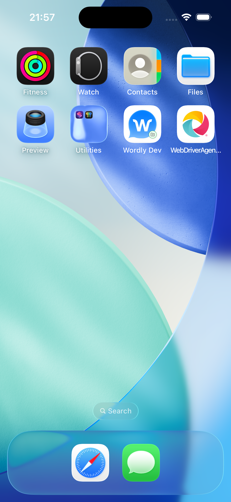

# Wordly iOS Fresh Consumer Proof

Date: 2026-06-28

This proof validates the NativeProof onboarding branch against a fresh consumer project and the
real private Wordly iOS app source, not the synthetic UIKit smoke app.

## Setup

- Fresh project: `/Users/agents/Projects/nativeproof-wordly-ios-fresh-proof`
- NativeProof package: local PR tarball `nativeproof-0.10.13.tgz`
- Wordly iOS source: `wordly-inc/wordly-mobile-ios`
- Wordly iOS branch: `main`
- Wordly iOS commit: `bf105c8 release: v4.3.1 - TTS ordering/cutoff fixes, crash fix, attendee placeholder fix (#13)`
- Simulator: booted iPhone 16, iOS 26.5

## Commands

```sh
npm init -y
npm install /Users/agents/Projects/nativeproof-0.10.13.tgz
npx nativeproof init --ios
mkdir -p ios
gh repo clone wordly-inc/wordly-mobile-ios ios/wordly-mobile-ios -- --depth 1
```

The fresh app build used Xcode directly, because NativeProof onboarding expects a built artifact:

```sh
xcodebuild \
  -project Wordly.xcodeproj \
  -scheme "Wordly Dev" \
  -configuration Debug \
  -sdk iphonesimulator \
  -destination 'generic/platform=iOS Simulator' \
  -derivedDataPath ../../.xcode/DerivedData \
  -clonedSourcePackagesDirPath ../../.xcode/SourcePackages \
  -packageCachePath ../../.xcode/PackageCache \
  -disablePackageRepositoryCache \
  -skipPackagePluginValidation \
  -skipMacroValidation \
  CODE_SIGNING_ALLOWED=NO \
  CODE_SIGNING_REQUIRED=NO \
  build
```

The build returned `65` because the app's Crashlytics run script could not find
`SourcePackages/checkouts/firebase-ios-sdk/Crashlytics/run`, but it still produced a usable 91 MB
simulator app. The proof copied that artifact to:

```sh
ios/Wordly.app
build/ios/Wordly.app
```

NativeProof onboarding worked against the built artifact:

```sh
npx nativeproof onboard ./ios/Wordly.app
```

Output:

```text
nativeproof: updated nativeproof.config.ts
nativeproof: package.json already exists — skipped
nativeproof: onboarded ios app at ./ios/Wordly.app

Next: run `npm run test:e2e` or `nativeproof --ios`.
```

The same command against the app repo directory failed clearly, as designed:

```sh
npx nativeproof onboard ./ios/wordly-mobile-ios
```

Output:

```text
nativeproof onboard: iOS project detected, but no built .app was found. Build the app for a simulator or pass the .app path.
```

## Spec

The fresh consumer spec drove the real Wordly app through first launch, accepted the EULA, and
asserted the home choices:

```ts
import { expect, native } from "../nativeproof.config";

describe("Wordly iOS first launch", () => {
  it("should accept the agreement and show the home choices", async () => {
    await native.navigate("/");

    const AgreementText = native.getByText(/I have read and agreed to the/i);
    const AgreementAndText = native.getByText("and");
    const AcceptAgreementCheckbox = native.getByRole("button").near(AgreementAndText, { maxDistance: 45 });
    const AcceptButton = native.getByRole("button", { name: "Accept" });

    await expect(native.getByText(/End-User License Agreement/i)).toBeVisible();
    await expect(AgreementText).toBeVisible();
    await expect(AcceptButton).toBeDisabled();
    await AcceptAgreementCheckbox.tap();
    await expect(AcceptButton).toBeEnabled();
    await AcceptButton.tap();

    await expect(native.getByText("How would you like to use Wordly?")).toBeVisible();
    await expect(native.getByRole("button", { name: "I'll speak" })).toBeVisible();
    await expect(native.getByRole("button", { name: "I'll listen or read" })).toBeVisible();
  });
});
```

Result:

```text
Spec Files: 1 passed, 1 total (100% completed) in 00:01:24
```

Screenshot:



## Findings

NativeProof is good enough to scaffold a fresh consumer project, onboard a real built Wordly iOS
`.app`, auto-start Appium, select the booted iOS simulator, install the XCUITest driver path, and
run a readable runner-native spec.

The EULA checkbox is not north-star readable because the current Wordly iOS app exposes it as an
unlabelled `XCUIElementTypeButton`, not a named checkbox. A trustworthy spec should eventually be:

```ts
const AcceptAgreementCheckbox = native.getByRole("checkbox", { name: /Accept Agreement/ });
await AcceptAgreementCheckbox.check();
await expect(AcceptAgreementCheckbox).toBeChecked();
```

Current Wordly iOS `main` does not make mocked login seamless. `WEBSOCKET_BASE_URL` is baked into
`Info.plist`, while auth and REST base URLs are hard-coded in `AuthConfig` and `WordlyAPIManager`.
`Configuration.swift` logs process environment values but does not return them as overrides. That
means NativeProof config alone cannot point presenter login at a mock backend today.
